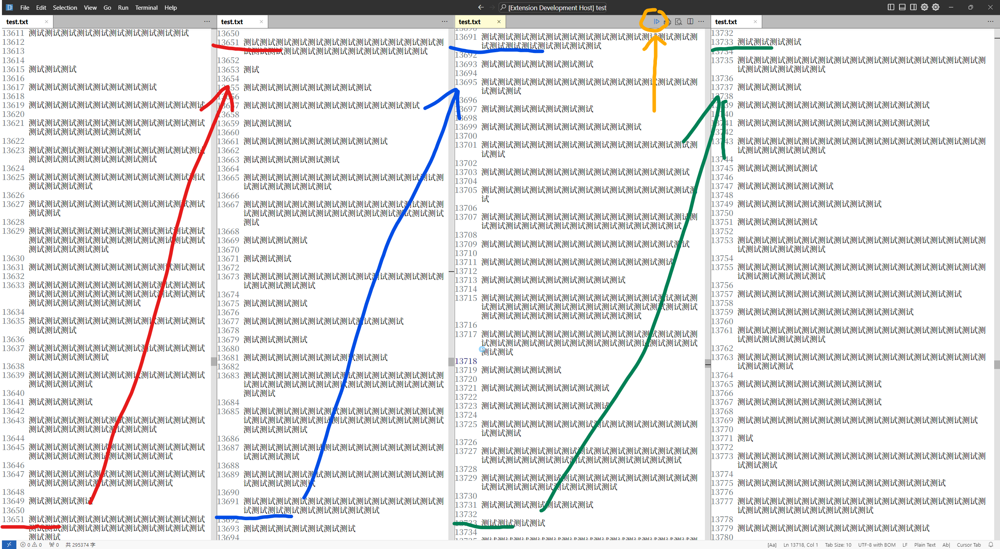
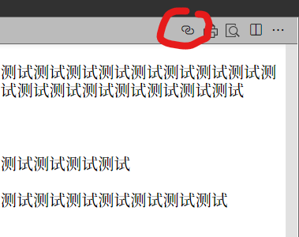

# Seamless Synchronized Scroll 无缝衔接同步滚动

A VS Code extension that synchronizes scrolling between adjacent editor groups showing the same file.
一个 VS Code 扩展，可以在显示同一文件的相邻编辑器组之间“无缝衔接”同步滚动。

Useful for novel, scriptwriting. Let you see long context at the same time, not just one page.
适用于小说、剧本创作。能让你同时看到很长的上下文，而不是仅仅一页内容。

## Features 功能特点

- Automatically synchronizes scrolling between adjacent editor groups
- 自动同步相邻编辑器组之间的滚动
- Maintains approximate seamless connection between editors
- 在编辑器之间保持大致的"无缝衔接"
- Easy to toggle on/off with a single click
- 只需单击即可轻松开启/关闭

## Usage 使用方法

1. Open the same file in adjacent editor tabs. 在相邻的编辑器 tab 中打开相同的文件。

2. Click the link icon in the editor title bar to enable synchronized scrolling. 点击编辑器标题栏中的链接图标以启用同步滚动。

3. To disable, click the link icon again. 要禁用，再次点击链接图标

## How it Works 工作原理

When enabled, the extension: 启用后，该扩展将：
1. Monitors scroll position changes in the active editor. 监控活动编辑器中的滚动位置变化
2. Automatically adjusts the scroll positions of adjacent editors. 自动调整相邻编辑器的滚动位置
3. Maintains a small overlap between editors for smooth reading experience. 在编辑器之间保持小幅重叠以获得流畅的阅读体验

## Known Issues 已知问题

Due to VS Code's limitations, precise synchronized scrolling and seamless connection cannot be achieved. This is due to VS Code's scrolling mechanism being different from general text editors. VS Code's API scrolling mechanism can only be based on logical lines, not physical lines generated by word wrapping when displaying in the editor window, let alone precise distances. Therefore, this issue arises. This problem cannot be resolved until VS Code provides a precise scrolling mechanism.
由于 VS Code 的局限性，无法实现精确的同步滚动，无法做到精确的"无缝衔接"。这是由于 VS Code 的不同于一般文本编辑器的滚动机制所导致。VS Code 的 API 的滚动机制只能基于 逻辑行（logical lines），而不能基于编辑器窗口显示时因自动换行而产生的 物理行（physical lines），更不能基于精确的距离。所以就产生了这样的问题。在 VS Code 不提供精确的滚动机制之前，这个问题无法解决。

If anyone can provide a method for precise scrolling, please let me know.
如果有人能提供精确的滚动方法，请告诉我。

## License

This extension is licensed under the GPL License.